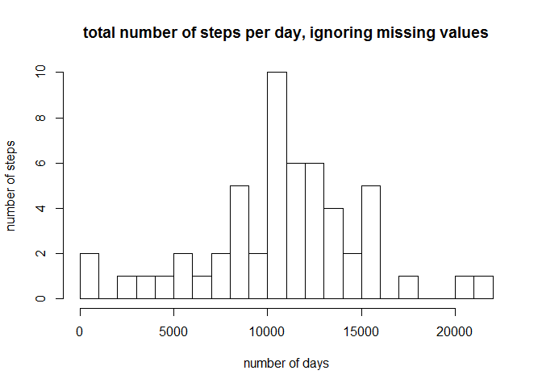
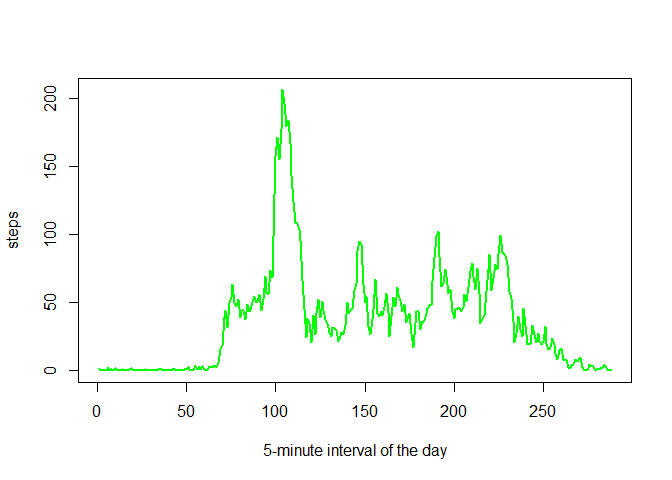
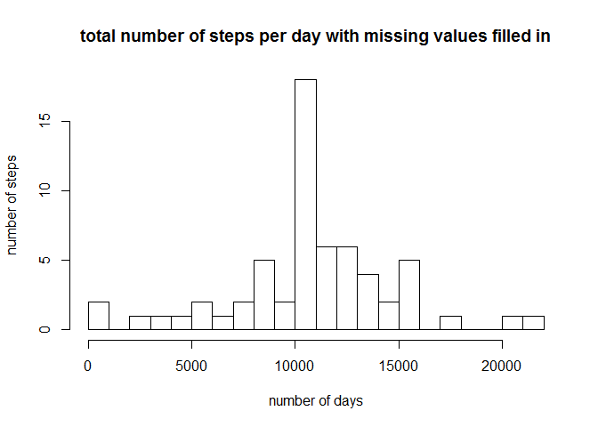

#  reproducible research exercise 1
oraclenj  

**Loading and preprocessing the data**


```r
library(ggplot2)
#library(scales)
library(lattice)

activ <- read.csv('activity.csv',header=TRUE)

activstep <- activ[complete.cases(activ[,1]),]

sumbyday <- aggregate(steps ~ date, activstep, sum)
```

**What is mean total number of steps taken per day?**

1.Make a histogram of the total number of steps taken each day


2.Calculate and report the mean and median total number of steps taken per day


```r
hist(sumbyday$steps,breaks=20,ylab="number of steps",xlab="number of days",main="total number of steps per day, ignoring missing values")
```

 

```r
namean <- mean(sumbyday$steps)
namedian <- median(sumbyday$steps)

cat("mean with nulls removed is ",namean)
```

```
## mean with nulls removed is  10766.19
```

```r
cat("median with nulls removed is ",namedian)
```

```
## median with nulls removed is  10765
```

**What is the average daily activity pattern?**

1.Make a time series plot (i.e. type = "l") of the 5-minute interval (x-axis) and the average number of steps taken, averaged across all days (y-axis)


2.Which 5-minute interval, on average across all the days in the dataset, contains the maximum number of steps?


x-axis is the 5-minute interval  
y-axis is the average number of steps taken per day  


```r
stepmean <- aggregate(steps ~ interval, activ, mean)
stepmean$intnum <- rownames(stepmean)

plot(stepmean$intnum, stepmean$steps, type="l", xlab= "5-minute interval of the day", ylab= "steps", col="green" , lwd=2)
```

 

```r
maxmean <- round(max(stepmean$steps))

maxinterval <- which.max(stepmean$steps)

cat ("the 5-minute interval with the greatest average number of steps is ", maxinterval, " with ",maxmean," steps")
```

```
## the 5-minute interval with the greatest average number of steps is  104  with  206  steps
```

**Imputing missing values**


1.Calculate and report the total number of missing values in the dataset (i.e. the total number of rows with NAs)


2.Devise a strategy for filling in all of the missing values in the dataset. The strategy does not need to be sophisticated. For example, you could use the mean/median for that day, or the mean for that 5-minute interval, etc.


3.Create a new dataset that is equal to the original dataset but with the missing data filled in.


4.Make a histogram of the total number of steps taken each day and Calculate and report the mean and median total number of steps taken per day. Do these values differ from the estimates from the first part of the assignment? What is the impact of imputing missing data on the estimates of the total daily number of steps?


```r
cat("There are ",length(which(is.na(activ$steps)))," rows with missing values, out of ",nrow(activ)," total rows")
```

```
## There are  2304  rows with missing values, out of  17568  total rows
```

```r
activnonulls <- merge(activ,stepmean,"interval")
str(activnonulls)
```

```
## 'data.frame':	17568 obs. of  5 variables:
##  $ interval: int  0 0 0 0 0 0 0 0 0 0 ...
##  $ steps.x : int  NA 0 0 0 0 0 0 0 0 0 ...
##  $ date    : Factor w/ 61 levels "2012-10-01","2012-10-02",..: 1 54 28 37 55 46 20 47 38 56 ...
##  $ steps.y : num  1.72 1.72 1.72 1.72 1.72 ...
##  $ intnum  : chr  "1" "1" "1" "1" ...
```

```r
whatsnull <- is.na(activnonulls$steps.x)


activnonulls$steps.x[whatsnull] <- activnonulls$steps.y[whatsnull]


cat("There are now ",length(which(is.na(activnonulls$steps.x)))," rows with missing values, out of ",nrow(activnonulls)," total rows")
```

```
## There are now  0  rows with missing values, out of  17568  total rows
```


```r
sumbydaynonulls <- aggregate(steps.x ~ date, activnonulls, sum)

hist(sumbydaynonulls$steps.x,breaks=20,main='total number of steps per day with missing values filled in',ylab="number of steps",xlab="number of days")
```

 

```r
filledmean <- mean(sumbydaynonulls$steps)
filledmedian <- median(sumbydaynonulls$steps)

cat("mean with imputed values for nulls is ",filledmean)
```

```
## mean with imputed values for nulls is  10766.19
```

```r
cat("median with imputed values for nulls is ",filledmedian)
```

```
## median with imputed values for nulls is  10766.19
```

```r
cat("the the mean with imputed values for nulls minus the mean with nulls removed is ",filledmean - namean)
```

```
## the the mean with imputed values for nulls minus the mean with nulls removed is  0
```

```r
cat("the the median with imputed values for nulls minus the median with nulls removed is ",filledmedian - namedian)
```

```
## the the median with imputed values for nulls minus the median with nulls removed is  1.188679
```

**Are there differences in activity patterns between weekdays and weekends?**

1.Create a new factor variable in the dataset with two levels ??? ???weekday??? and ???weekend??? indicating whether a given date is a weekday or weekend day.

2.Make a panel plot containing a time series plot (i.e. type = "l") of the 5-minute interval (x-axis) and the average number of steps taken, averaged across all weekday days or weekend days (y-axis). See the README file in the GitHub repository to see an example of what this plot should look like using simulated data.


```r
activnonulls$daytype <- as.factor(ifelse(weekdays(as.Date(activnonulls$date)) %in% c('Sunday','Saturday'),'weekend','weekday' ))


weekendmean <- aggregate(steps.x ~ interval, activnonulls[which(activnonulls$daytype == "weekend"),], mean)
weekdaymean <- aggregate(steps.x ~ interval, activnonulls[which(activnonulls$daytype == "weekday"),], mean)
weekendmean$intnum <- rownames(stepmean)
weekdaymean$intnum <- rownames(stepmean)

par(mfrow=c(2,1))

plot(weekendmean$intnum, weekendmean$steps.x, type="l", xlab= "5-minute interval of the weekend day", ylab= "steps", col="green" , lwd=2)


plot(weekdaymean$intnum, weekdaymean$steps.x, type="l", xlab= "5-minute interval of the weekend day", ylab= "steps", col="red" , lwd=2)
```

 
